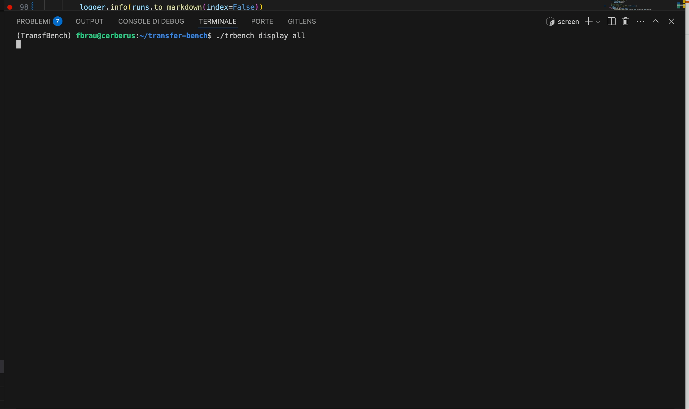
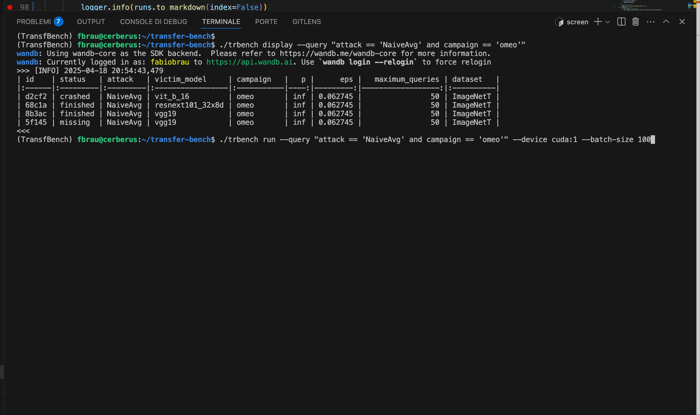
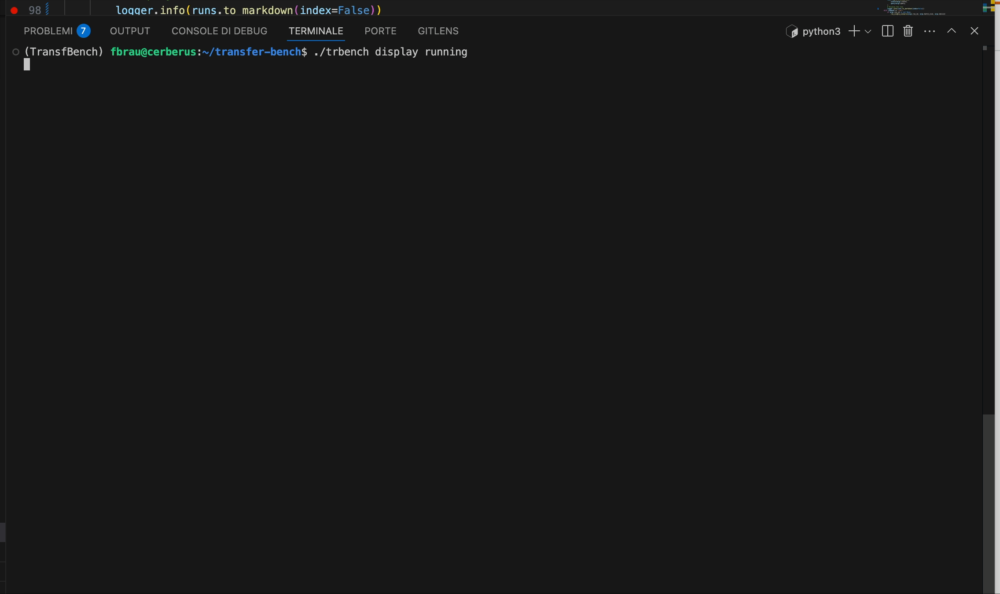

# Instruction README for Using the `trbench` Script

The `trbench` script is a command-line tool designed for managing and running tasks related to benchmarking. This script is intended for **internal usage only** and requires specific prerequisites to function correctly.


# 🧪 Transfer Attack CLI Usage Guide

This CLI tool allows you to **display**, **filter**, and **run** transfer attack benchmark jobs using Weights & Biases logging. All the members of the Weights & Biases team `transfer-team` will have access to the project `transfer-bench` and can run attacks simultaneously since there is a control of conflicts.

🔗 [Go to the project on Weights & Biases](https://wandb.ai/transfer-team/transfer-bench) ![wandb-icon]

Below are three example use cases, each demonstrated with a short video.

---

## 📌 Case 1: Displaying Jobs

You can use the `display` subcommand to inspect runs. Here are a few common usage examples.

### ✅ Display all runs:
```bash
./trbench display all
```

### ❌ Display only crashed runs:
```bash
./trbench display crashed
```

### 🔍 Display NaiveAvg runs in the "omeo" campaign:
```bash
./trbench display all --query 'surrogate == "NaiveAvg" and campaign == "omeo"'
```

🎥 **Demo Video:** [](../examples/demos/demo display all.mp4)

---

## 📌 Case 2: Run Jobs Using a Query

Re-run failed/missing runs that match a previous query.

### ▶️ Re-run "NaiveAvg" runs in the "omeo" campaign:
```bash
./trbench run --query 'surrogate == "NaiveAvg" and campaign == "omeo"'
```

The script will automatically filter out completed jobs and only re-run those with `status in ["missing", "failed", "crashed"]`.

🎥 **Demo Video:** [](../examples/demos/demo running batch.mp4)

---

## 📌 Case 3: Display Running Jobs

To monitor jobs currently in progress:

```bash
./trbench display running
```

🎥 **Demo Video:** [](../examples/demos/demo display running.mp4)

---

## 🛠️ Setup

You can run this script by cloning the repository and installing the requirements in a virtual environment using either `pip` or `conda`:

🔗 [GitHub Repository – transfer-bench](https://github.com/fabiobrau/transfer-bench)

```bash
# Clone the repo
git clone https://github.com/fabiobrau/transfer-bench
cd transfer-bench

# Using pip and venv
python3 -m venv env
source env/bin/activate
pip install -r requirements.txt

# Or using conda
conda create -n transfer-bench python=3.9
conda activate transfer-bench
pip install -r requirements.txt
```

Once set up, you can run the CLI using `./trbench`.


### Weight and biases account

In the future we will make this optional.

1. **Weights and Biases Account**:  
    You must have an active [Weights and Biases](https://wandb.ai/) account. This is required for logging and tracking the benchmarking experiments. Follow the instruction at your first run

2. **Transfer-Bench Team Membership**:  
    Ensure that you are part of the **Transfer-Bench team** on Weights and Biases. Access to this team is mandatory to use the script effectively.