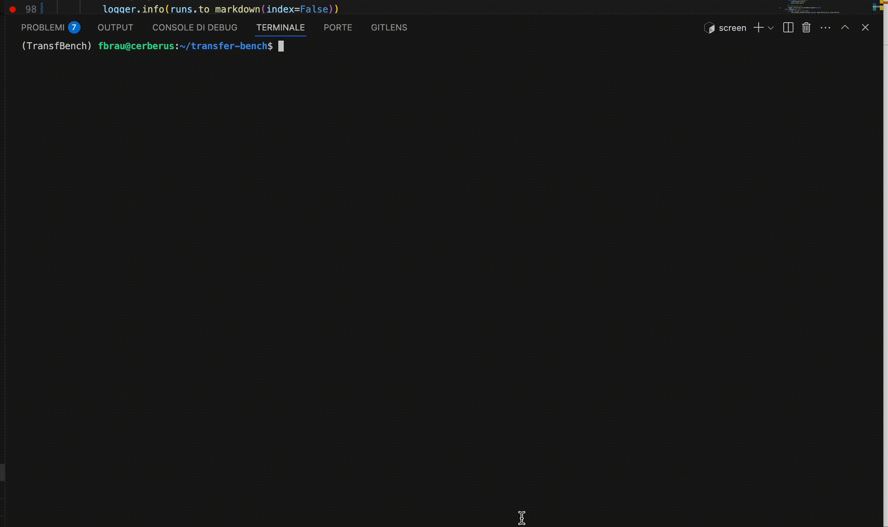

# 🧪 Transfer Attack CLI Usage Guide
--------------

This CLI tool allows you to **display**, **filter**, and **run** transfer attack benchmark jobs using Weights & Biases logging. The script exposes four sub-commands: `display, run, config, report`.
Below are three example use cases, each demonstrated with a short video.

## 🛠️ Setup

### 1. **Install transferbench**

The cli-command is installed togheter with the transferbench package via pip by running
```bash
pip install git+https://git@github.com/pralab/transfer-bench.git
```
You can run the script just by typing `trbench` anywhere in your terminal.
Run `trbench --help` for check that installations went out smoothly.

### 2. **Weights and Biases Account**: 
To use the script you must have an active [Weights and Biases](https://wandb.ai/) account. This is required for logging and tracking the benchmarking experiments, and you must create a team (otherwise you can use your personal profile) `<my-team>` and you must create a project `my-project`.

### 3. **Setup the configurations**

Run the `trbench config` to setup the configurations*
```bash
trbench config --project-entity <my-team> --project-name <my-project>
```

All the members of the Weights & Biases team `<my-team>` will have access to the project `<my-project>` and can run attacks simultaneously since there is a control of conflicts.


## Usage of the command line

### Displaying Runs 👀 

You can use the `display` subcommand to inspect runs. Here are a few common usage examples.

**Display all the runs:** For displaying all the availables runs you can use this command
```bash
trbench display all
```

**Display only crashed ❌ runs**
```bash
trbench display crashed
```

**🔍 Display NaiveAvg runs by a matching criterion**

You can inspect only runs which satisfy a criteria by leveraging the `--query` option. For exmaple, the follwoing command visualize the runs in the "omeo" campaign
```bash
trbench display all --query 'surrogate == "NaiveAvg" and campaign == "omeo"'
```


Run `trbench display --help` to get more infos, other options include `running, failed, crashed`.


## 🚀 Case 2: Lounching Jobs Using query-matching criterion

The command line allows to run the evaluations and store the results both in local and in the weight and biases project. The default directory is the `results` directory in the same path where the cli-command has been executed. This can be modified with the `config` subcommand.

Re-run failed/missing runs that match a previous query.
### Re-run "NaiveAvg" runs in the "omeo" campaign:
```bash
trbench run --query 'surrogate == "NaiveAvg" and campaign == "omeo"'
```

The script will automatically filter out completed jobs and only re-run those with `status in ["missing", "failed", "crashed"]`.



*N.B* To re-run a previously run job you must use the flat `--overwrite`, be careful.


